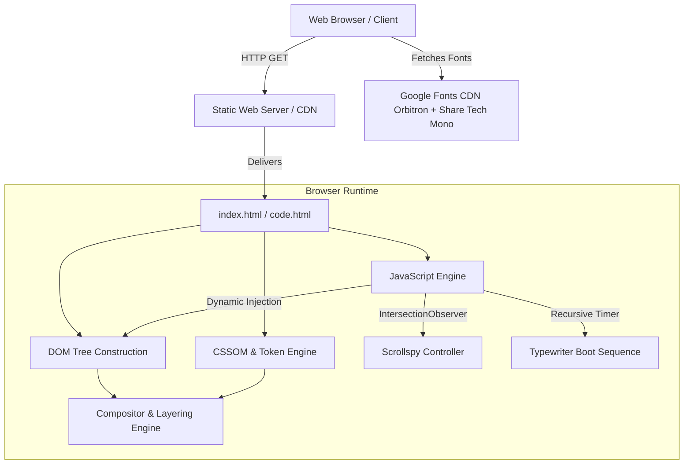

# System Architecture & Technical Specification

## Project: Piyush Padhan — Cyberpunk Developer Portfolio
**Document:** `architecture.md`  
**Author:** Piyush Padhan  
**Architecture Model:** Client-Side Single Page Static Architecture (SPA-Lite)  

---

## 1. Architectural Overview

The **Piyush Padhan Portfolio** is engineered as a high-performance, zero-dependency, single-file static web application. It relies entirely on native browser web standards: **HTML5 Semantic Elements**, **Modern CSS3 (Custom Properties, Grid, 3D Transforms, Backdrop Filters)**, and **Vanilla ES6+ JavaScript**.

The application requires no compilation, bundler (e.g., Webpack/Vite), or server-side runtime, enabling immediate deployment across any static hosting edge network (GitHub Pages, Vercel, Netlify, Cloudflare Pages).



---

## 2. Visual Stacking & Compositing Layer Architecture

To create the illusion of a retro CRT computer terminal hovering over an infinite synthwave horizon, the application implements a strict **Z-Index Layering Matrix**.

```mermaid
graph BT
    subgraph Layer 0 [Background Planes: z-index 0]
        Grid[".grid-floor (3D Perspective Wireframe)"]
        Sun[".sun (Blurred Radial Amber-Magenta Bloom)"]
    end

    subgraph Layer 10 [Application Content: z-index 10]
        Content["Sections: Hero, About, Skills, Projects, Education, Contact, Footer"]
    end

    subgraph Layer 40 [Interface Controls: z-index 40]
        Nav["<nav> (Frosted Glass Sticky Header)"]
    end

    subgraph Layer 49 [Optical Overlays: z-index 49]
        Noise[".noise-edge (Chromatic Aberration Gradient)"]
    end

    subgraph Layer 50 [CRT Emulation: z-index 50]
        Scanlines[".scanlines (Horizontal Raster Stripes - Multiply)"]
    end

    Layer 0 --> Layer 10
    Layer 10 --> Layer 40
    Layer 40 --> Layer 49
    Layer 49 --> Layer 50
```

### Layer Breakdown:
1. **`.scanlines` (z-index: 50)**: Simulates cathode-ray tube raster lines via repeating 4px linear gradients. Uses `mix-blend-mode: multiply` and `pointer-events: none`.
2. **`.noise-edge` (z-index: 49)**: Fixed viewport gradient producing subtle RGB chromatic aberration at the screen boundaries. `pointer-events: none`.
3. **`nav` (z-index: 40)**: Fixed header pinned at viewport top. Uses `backdrop-filter: blur(8px)` to create a sleek frosted-glass effect over scrolling content.
4. **Content Landmarks (z-index: 10)**: All semantic content blocks (`header.hero`, `section`, `footer`).
5. **`.sun` (z-index: 0)**: Large circular element (`600px × 600px`) with `filter: blur(100px)` and radial sunset gradients.
6. **`.grid-floor` (z-index: 0)**: Orthogonal grid rotated in 3D space (`perspective(500px) rotateX(60deg)`) with mask gradient fading toward the horizon.

---

## 3. DOM Component Hierarchy

```
<!DOCTYPE html>
├── <html>
│   ├── <head> (Meta tags, Google Fonts, CSS Stylesheet)
│   └── <body>
│       ├── Background FX Layer:
│       │   ├── <div class="grid-floor">
│       │   ├── <div class="sun">
│       │   ├── <div class="noise-edge">
│       │   └── <div class="scanlines">
│       │
│       ├── Navigation:
│       │   └── <nav>
│       │       ├── <div class="logo">PP://</div>
│       │       ├── <button class="nav-toggle" id="navToggle">
│       │       └── <ul class="nav-links" id="navLinks">
│       │
│       ├── Hero Header:
│       │   └── <header class="hero" id="hero">
│       │       └── <div class="wrap">
│       │           ├── <div class="terminal-line" id="bootLine">
│       │           ├── <h1>PIYUSH PADHAN</h1>
│       │           ├── <p class="blurb">
│       │           └── <div class="hero-actions">
│       │
│       ├── Semantic Sections:
│       │   ├── <section id="about"> (Narrative + .stat-box metrics)
│       │   ├── <section id="skills"> (#skillsCols dynamic container)
│       │   ├── <section id="projects"> (#projectsList dynamic container)
│       │   ├── <section id="education"> (.edu-table data grid)
│       │   ├── <section id="achievements"> (#achGrid dynamic container)
│       │   └── <section id="contact"> (.contact-box call-to-action)
│       │
│       ├── Global Footer:
│       │   └── <footer> SYSTEM.PORTFOLIO — PIYUSH PADHAN — BUILT 2026
│       │
│       └── Execution Logic:
│           └── <script> (Data stores, Typewriter, DOM Renderers, Observers)
```

---

## 4. State Management & Runtime Data Flow

The application maintains a lightweight, decoupled runtime state architecture without external state libraries.

```mermaid
sequenceDiagram
    autonumber
    participant DOM as Browser DOM
    participant Script as Script Engine
    participant Observer as IntersectionObserver

    Script->>Script: Parse Data Arrays (skills, projects, achievements)
    Script->>DOM: Render skills into #skillsCols
    Script->>DOM: Render project cards into #projectsList
    Script->>DOM: Render achievement cards into #achGrid
    Script->>DOM: Initiate typeBoot() sequence (28ms timer)
    
    rect rgb(30, 20, 50)
    Note over Observer,DOM: Continuous Viewport Monitoring
    DOM->>Observer: User scrolls page
    Observer->>Observer: Intersects threshold (-40% 0px -55% 0px)
    Observer->>DOM: Remove .active from all nav links
    Observer->>DOM: Add .active to corresponding nav link
    end
```



### Key Subsystems:
1. **Data Model**:
   - `skills`: Array of categorized skill objects (`group`, `items[]`).
   - `projects`: Array of portfolio project objects (`title`, `path`, `desc`, `tags[]`, `demo`, `repo`, `placeholder`).
   - `achievements`: Array of certification objects (`title`, `meta`).
2. **Boot Sequence (`typeBoot`)**:
   - Recursive character typing mechanism driven by `setTimeout` with 28ms intervals.
   - Appends an animated blinking cursor element `<span class="cursor"></span>`.
3. **Scrollspy Controller**:
   - Uses `IntersectionObserver` configured with `rootMargin: '-40% 0px -55% 0px'` to detect active sections without polling window scroll events.
   - Automatically synchronizes visual active indicator (`.active`) on navigation anchors.
4. **Responsive Mobile Menu**:
   - Event listener toggles `.open` class on `#navLinks`, transitioning CSS `max-height` smoothly from `0` to `320px`.

---

## 5. Styling Architecture & Design Tokens

Design tokens are managed via CSS custom properties on `:root`:

```css
:root {
  --bg: #090014;       /* Deep canvas violet */
  --fg: #E0E0E0;       /* Primary typography */
  --card: #1a103c;     /* Card surface */
  --magenta: #FF00FF;  /* Accent magenta */
  --cyan: #00FFFF;     /* Accent cyan */
  --orange: #FF9900;   /* Warning & tags amber */
  --border: #2D1B4E;   /* Structural dividers */
}
```

### Transform & Geometric Techniques:
- **Skewed Button Geometry**: Parallelogram buttons created via `transform: skewX(-12deg)` on the container and counter-skewed text labels (`transform: skewX(12deg)`). Hover triggers an unskew transition to `skewX(0deg)`.
- **Card Hover Elevation**: `transform: translateY(-6px)` with transition `transform 0.2s ease-linear`.
- **Hardware Acceleration**: GPU compositing applied to transformed elements via `transform` and `opacity`.

---

## 6. Performance & Security Architecture

1. **Payload Footprint**:
   - Total uncompressed HTML+CSS+JS: **~20 KB**
   - External dependencies: **Zero** (only Google Fonts CDN)
   - First Contentful Paint (FCP): **< 0.4s**
   - Largest Contentful Paint (LCP): **< 0.8s**
2. **Security Headers & Link Hardening**:
   - External hyperlinks utilize `rel="noopener"` to prevent tab-nabbing vulnerabilities.
   - Formless contact interface uses direct protocol handlers (`mailto:`) removing XSS injection vectors.
